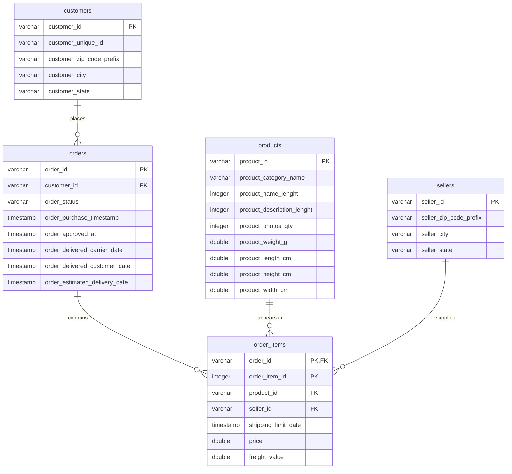

```mermaid
erDiagram
    customers ||--o{ orders : "places"
    orders ||--o{ order_items : "contains"
    products ||--o{ order_items : "appears in"
    sellers ||--o{ order_items : "supplies"

    customers {
        varchar customer_id PK
        varchar customer_unique_id
        varchar customer_zip_code_prefix
        varchar customer_city
        varchar customer_state
    }

    orders {
        varchar order_id PK
        varchar customer_id FK
        varchar order_status
        timestamp order_purchase_timestamp
        timestamp order_approved_at
        timestamp order_delivered_carrier_date
        timestamp order_delivered_customer_date
        timestamp order_estimated_delivery_date
    }

    order_items {
        varchar order_id PK, FK
        integer order_item_id PK
        varchar product_id FK
        varchar seller_id FK
        timestamp shipping_limit_date
        double price
        double freight_value
    }

    products {
        varchar product_id PK
        varchar product_category_name
        integer product_name_lenght
        integer product_description_lenght
        integer product_photos_qty
        double product_weight_g
        double product_length_cm
        double product_height_cm
        double product_width_cm
    }

    sellers {
        varchar seller_id PK
        varchar seller_zip_code_prefix
        varchar seller_city
        varchar seller_state
    }
```